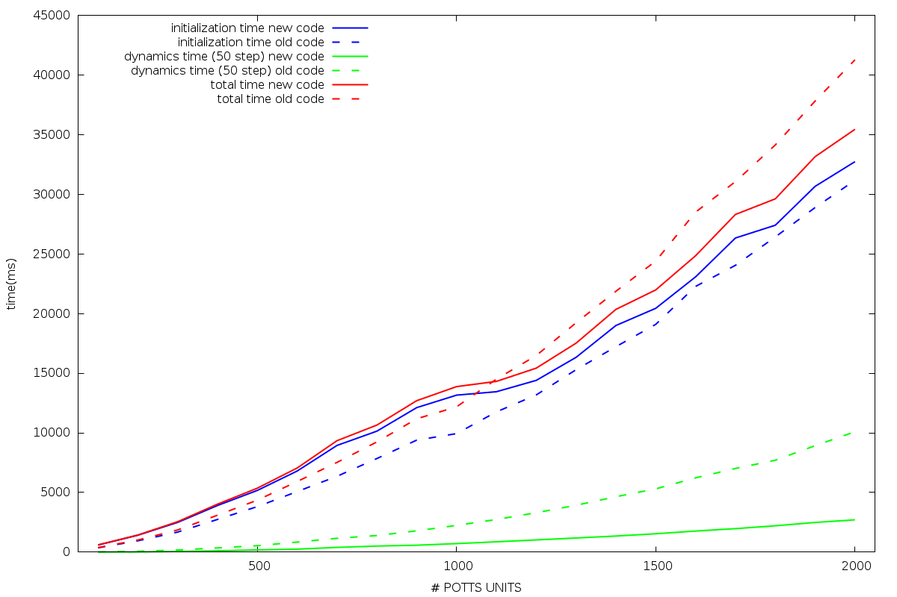
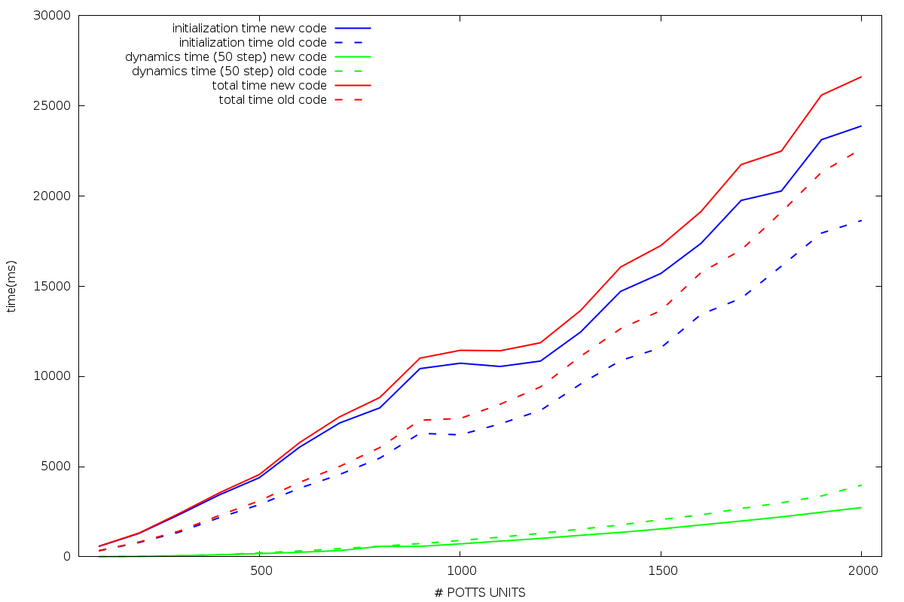
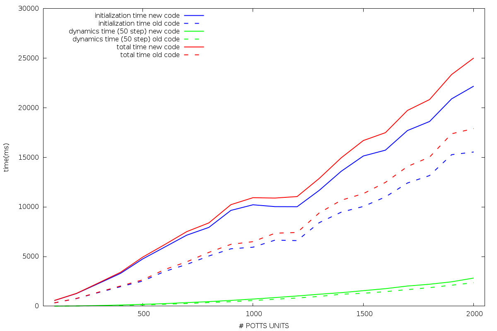
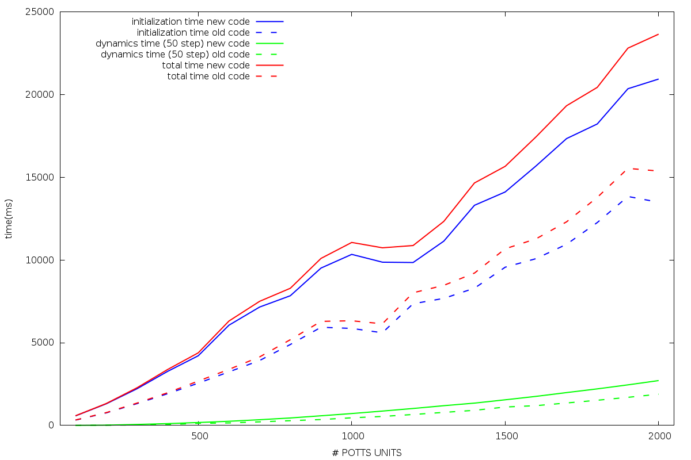

# Timing old code vs new code potts unit sweeping

In this test I have made a comparison of the timings between the new code and the old code in the dynamic part. The test was made running the simulation with just one pattern as initial cue. This is the plot:
This is for 600 updates of the whole network.

I have also made with perf the count of cache misses for the last configuration (2000 potts units) and this is the output.

##NEW CODE

    perf stat -B -e cache-references,cache-misses,cycles,instructions,branches,faults,migrations ./main.x > perf_stats.log

     Performance counter stats for './main.x':

         2,656,336,429      cache-references
           892,563,295      cache-misses              #   33.601 % of all cache refs
       172,563,821,109      cycles
       323,297,212,404      instructions              #    1.87  insns per cycle
        28,635,534,857      branches
                99,704      faults
                     8      migrations

          49.010746580 seconds time elapsed

##OLD CODE

    perf stat -B -e cache-references,cache-misses,cycles,instructions,branches,faults,migrations ./master.x

    Performance counter stats for './master.x':

        4,897,997,682      cache-references
        1,273,800,598      cache-misses              #   26.007 % of all cache refs
      320,770,005,973      cycles
      473,299,657,367      instructions              #    1.48  insns per cycle
       19,357,900,795      branches
              148,646      faults
                   68      migrations

         90.832652081 seconds time elapsed

The tests were made in a local machine with the following hardware

#Sweeping with different N/C ratio and added initialization and total time
This test was made keeping fix at 100 updates every simulation. I have changed in the following 4 plots the ration between the number of Potts units and connections, for example for 600 units I tested 300 connections, 120 connections, 75 connections and 60 connections testing both the timings of the initialization dynamics and total time.

N/C=2

N/C=5

N/C=8

N/C=10

As we can see the initialization requires always more time in the new code but will be a fixed time constant varying the number of updates.

The dynamic part in the new code is much less time consuming than the old code if we take a the ration N/C less than 5. The time to evaluate 100 updates of the network with a N/C ratio equal to  2 it takes for 2000 units 2,713 seconds while the new code requires 10,098 (new/old code dynamics time ratio = 3.7).

#Cache profiling
In the following folder there's the output of cachegrind. Also with perf I did new tests and this is the following output with N= 600 C=300 and this time 1000 updates.

##OLD CODE
    perf stat -e L1-dcache-loads,L1-dcache-load-misses,L1-dcache-stores,LLC-loads,LLC-load-misses,LLC-stores,LLC-prefetches ./master.x
    Performance counter stats for './master.x':

       35,445,784,584      L1-dcache-loads                                               (42.94%)
        3,350,512,423      L1-dcache-load-misses     #    9.45% of all L1-dcache hits    (57.28%)
        7,024,466,636      L1-dcache-stores                                              (57.33%)
          373,005,728      LLC-loads                                                     (57.40%)
          173,757,532      LLC-load-misses           #   46.58% of all LL-cache hits     (57.25%)
            4,550,462      LLC-stores                                                    (28.54%)
          357,629,616      LLC-prefetches                                                (28.56%)

         13.351015930 seconds time elapsed

##NEW CODE
    perf stat -e L1-dcache-loads,L1-dcache-load-misses,L1-dcache-stores,LLC-loads,LLC-load-misses,LLC-stores,LLC-prefetches ./main.x
    Performance counter stats for './main.x':

        14,612,529,736      L1-dcache-loads                                               (42.88%)
           635,619,055      L1-dcache-load-misses     #    4.35% of all L1-dcache hits    (57.17%)
         3,194,277,388      L1-dcache-stores                                              (57.17%)
           432,212,390      LLC-loads                                                     (57.17%)
           157,485,599      LLC-load-misses           #   36.44% of all LL-cache hits     (57.14%)
               354,339      LLC-stores                                                    (28.56%)
           169,634,932      LLC-prefetches                                                (28.57%)

           9.099069022 seconds time elapsed

###lscpu

    Architecture:          x86_64
    CPU op-mode(s):        32-bit, 64-bit
    Byte Order:            Little Endian
    CPU(s):                8
    On-line CPU(s) list:   0-7
    Thread(s) per core:    2
    Core(s) per socket:    4
    Socket(s):             1
    NUMA node(s):          1
    Vendor ID:             GenuineIntel
    CPU family:            6
    Model:                 60
    Model name:            Intel(R) Core(TM) i7-4720HQ CPU @ 2.60GHz
    Stepping:              3
    CPU MHz:               1600.015
    CPU max MHz:           3600.0000
    CPU min MHz:           800.0000
    BogoMIPS:              5190.11
    Virtualization:        VT-x
    L1d cache:             32K
    L1i cache:             32K
    L2 cache:              256K
    L3 cache:              6144K
    NUMA node0 CPU(s):     0-7

###cpuinfo

    processor	: 7
    vendor_id	: GenuineIntel
    cpu family	: 6
    model		: 60
    model name	: Intel(R) Core(TM) i7-4720HQ CPU @ 2.60GHz
    stepping	: 3
    microcode	: 0x1c
    cpu MHz		: 2600.304
    cache size	: 6144 KB
    physical id	: 0
    siblings	: 8
    core id		: 3
    cpu cores	: 4
    apicid		: 7
    initial apicid	: 7
    fpu		: yes
    fpu_exception	: yes
    cpuid level	: 13
    wp		: yes
    flags		: fpu vme de pse tsc msr pae mce cx8 apic sep mtrr pge mca cmov pat pse36 clflush dts acpi mmx fxsr sse sse2 ss ht tm pbe syscall nx pdpe1gb rdtscp lm constant_tsc arch_perfmon pebs bts rep_good nopl xtopology nonstop_tsc aperfmperf eagerfpu pni pclmulqdq dtes64 monitor ds_cpl vmx est tm2 ssse3 fma cx16 xtpr pdcm pcid sse4_1 sse4_2 x2apic movbe popcnt tsc_deadline_timer aes xsave avx f16c rdrand lahf_lm abm ida arat epb pln pts dtherm tpr_shadow vnmi flexpriority ept vpid fsgsbase tsc_adjust bmi1 avx2 smep bmi2 erms invpcid xsaveopt
    bugs		:
    bogomips	: 5190.11
    clflush size	: 64
    cache_alignment	: 64
    address sizes	: 39 bits physical, 48 bits virtual
