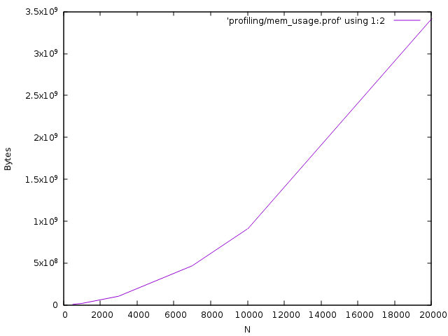

# Profiling #

This is the first profiling of the code.

### Computational time bottlenecks (using Gprof) ###

as we can see from the [GPROF OUTPUT](analysis.profiling) for Tneuro = 1
update_stato is called 6000, which is 10 times N, this is caused by this outer loop.

        for(f=0;f<p;f++)   ///	 per  diversi pattern di inizio

running

        make profile
    ./generator
    perf record ./main.x

and in the end

    perf report

we can see that there's a region "hot sampled" by the profiler, which is in assembly:

    3.80 │       mov    (%rcx),%rcx                                                                                                                                                                                                             ▒
         │       mov    -0x18(%rbp),%esi                                                                                                                                                                                                        ▒
         │       movslq %esi,%rsi                                                                                                                                                                                                               ▒
         │       shl    $0x2,%rsi                                                                                                                                                                                                               ▒
    5.70 │       add    %rsi,%rcx                                                                                                                                                                                                               ▒
    0.63 │       mov    (%rcx),%ecx                                                                                                                                                                                                             ▒
    0.63 │       movslq %ecx,%rcx                                                                                                                                                                                                               ▒
         │       shl    $0x3,%rcx                                                                                                                                                                                                               ▒
    2.53 │       add    %rcx,%rax                                                                                                                                                                                                               ◆
         │       mov    (%rax),%rax                                                                                                                                                                                                             ▒
    0.63 │       mov    -0x1c(%rbp),%ecx                                                                                                                                                                                                        ▒
         │       movslq %ecx,%rcx                                                                                                                                                                                                               ▒
    3.16 │       shl    $0x2,%rcx                                                                                                                                                                                                               ▒
    0.63 │       add    %rcx,%rax                                                                                                                                                                                                               ▒
         │       movss  (%rax),%xmm0                                                                                                                                                                                                            ▒
    2.53 │       mulss  %xmm2,%xmm0                                                                                                                                                                                                             ▒
    12.03 │       addss  %xmm0,%xmm1                                                                                                                                                                                                             ▒
    7.59 │       movd   %xmm1,%eax                                                                                                                                                                                                              ▒
    0.63 │       mov    %eax,(%rdx)                                                                                                                                                                                                             ▒
         │     {                                                                                                                                                                                                                                ▒
         │             ///     di  h                                                                                                                                                                                                            ▒
         │             h[i][k]=0.;                                                                                                                                                                                                              ▒
         │              for(x=0;x<Cm;x++)                                                                                                                                                                                                       ▒
         │             {                                                                                                                                                                                                                        ▒
         │                     for(l=0;l<S;l++)                                                                                                                                                                                                 ▒
    4.43 │       addl   $0x1,-0x1c(%rbp)                                                                                                                                                                                                        ▒
    1.27 │254:   cmpl   $0x2,-0x1c(%rbp)                                                                                                                                                                                                        ▒
         │     ↑ jle    163                                                                                                                                                                                                                     ▒
         │                                                                                                                                                                                                                                      ▒
         │     for(k=0;k<S;k++)

this zone

        12.03 │       addss  %xmm0,%xmm1  

is inside the main  loop. Which tells where the main bottleneck is.

        for(k=0;k<S;k++)
        {
        	///	di  h
        	h[i][k]=0.;
        	 for(x=0;x<Cm;x++)
        	{
        		for(l=0;l<S;l++)
        		{
        		 h[i][k]+=	J[i][x][k][l]*s[C[i][x]][l];
        		}
        	}
        	h[i][k]+=w*s[i][k]-self+ INcost*(xi[i][retr]==k);										//tolgo l`auto eccitazione
        	/// di sold, thteta, r
        	sold[i][k]=s[i][k];

        	theta[i][k]+=b2*(s[i][k]-theta[i][k]);								//update theta
        	r[i][k]+=b1*(h[i][k]-theta[i][k]-r[i][k]);								//update r

        	if(r[i][k]>rmax)												//(per evitare l'overflow calcolando s)
        	{
        		rmax=r[i][k];
        	}
        }

### Memory Consumption ###

Using valgrind this is the output of the total memory reserved vs size of the simulation (N)

